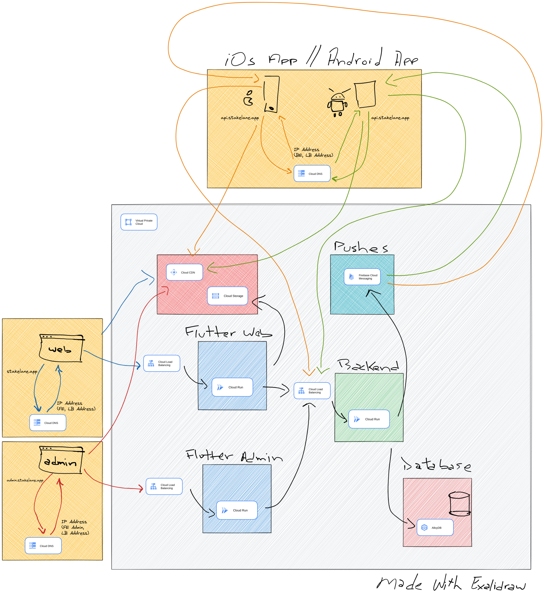
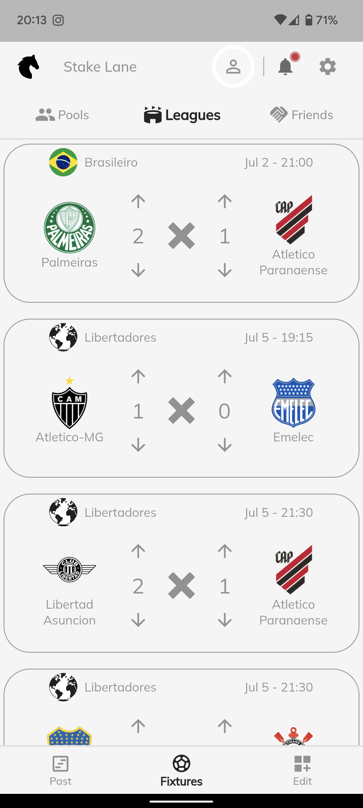
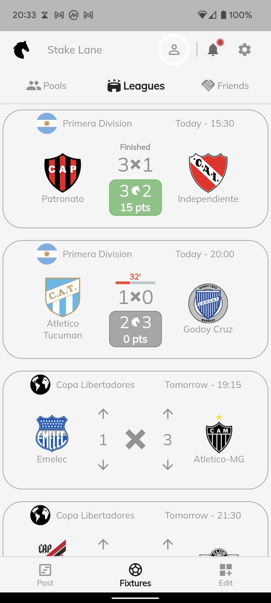
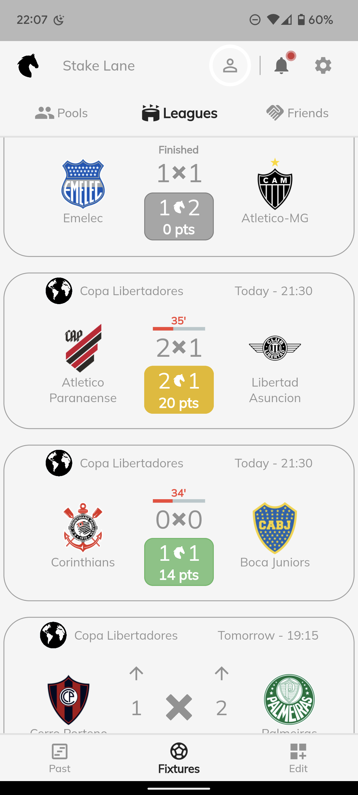

# Stake Lane

A social sports prediction platform where users can predict football match outcomes, compete with friends, and earn points based on prediction accuracy.



## Overview

Stake Lane is a full-stack football prediction application that combines a powerful Elixir/Phoenix backend with a cross-platform Flutter frontend. Users can follow their favorite leagues and teams, make predictions on upcoming matches, track live scores, and compete with friends through prediction pools.

### Key Features

- **Match Predictions**: Intuitive interface for predicting match outcomes before kickoff
- **Live Score Tracking**: Real-time updates during matches with minute-by-minute progress
- **Points & Leaderboards**: Earn points for accurate predictions and compete with friends
- **Social Features**: Create private pools, join public competitions, and connect with other users
- **Multi-League Support**: Coverage of major football leagues including Brasileirão, Copa Libertadores, and more
- **Cross-Platform**: Available on iOS, Android, and Web

## Screenshots

### Match Prediction Interface
<div style="display: flex; gap: 10px;">
  
  
  
</div>

**Features shown:**
- **Predictable Matches**: Use up/down arrows to predict match outcomes before kickoff
- **Live Matches**: Real-time score updates with minute indicators (32', 35', 34')
- **Finished Matches**: Final scores with points earned (color-coded: green for correct, gray for incorrect, yellow for partially correct)

## Architecture

The application follows a multi-tier architecture with clear separation of concerns:

### Backend (Elixir/Phoenix API)
- **Phoenix Web Layer**: RESTful API endpoints and request handling
- **Business Logic Layer**: Core application logic organized by domain contexts
- **Data Layer**: Ecto schemas and PostgreSQL with PostGIS
- **External Services**: Integration with API-Football for real-time match data
- **Background Jobs**: Oban workers for asynchronous data synchronization
- **Authentication**: Pow framework with OAuth provider support

### Frontend (Flutter)
- **Flutter Web/Mobile Apps**: Cross-platform UI for iOS, Android, and Web
- **State Management**: GetX for reactive state management
- **API Integration**: HTTP client for backend communication
- **Responsive Design**: Adaptive layouts for all screen sizes

## Tech Stack

### Backend (stake_lane_api/)

**Core Technologies**
- **Elixir** ~1.13.4 - Functional programming language
- **Phoenix Framework** ~1.5.1 - Web framework
- **Ecto** ~3.5.3 - Database wrapper and query generator
- **PostgreSQL** with **PostGIS** - Relational database with geographic support

**Key Libraries**
- **Pow** ~1.0.27 - Authentication framework
- **PowAssent** ~0.4.13 - Multi-provider OAuth
- **Oban** ~2.2 - Background job processing
- **HTTPoison** ~1.7 - HTTP client for external APIs
- **Timex** ~3.5 - Date and time handling
- **Geolix** ~2.0 - IP geolocation

### Frontend (stake-lane-web-app/)

**Core Technologies**
- **Flutter** 3.0+ - Cross-platform framework
- **Dart** 2.17.5+ - Programming language
- **GetX** ^4.6.5 - State management and routing

**Key Dependencies**
- **Google Fonts** ^3.0.1 - Typography (Mulish)
- **Intl** ^0.17.0 - Internationalization
- **HTTP** ^0.13.4 - API communication
- **Percent Indicator** ^4.2.2 - Visual statistics
- **Infinite Scroll Pagination** ^3.2.0 - Efficient list loading

## Project Structure

```
stake-lane/
├── stake_lane_api/           # Backend API (Elixir/Phoenix)
│   ├── config/              # Application configuration
│   ├── lib/
│   │   ├── api_football/    # API-Football integration
│   │   ├── stake_lane_api/  # Core business logic
│   │   │   ├── countries/   # Country management
│   │   │   ├── football/    # Leagues, teams, fixtures
│   │   │   ├── users/       # User management & predictions
│   │   │   └── workers/     # Background jobs
│   │   └── stake_lane_api_web/  # Web layer
│   │       ├── controllers/ # API endpoints (v1)
│   │       ├── views/       # JSON views
│   │       └── router.ex    # Route definitions
│   ├── priv/
│   │   ├── gettext/         # Translations (en, pt_BR, es)
│   │   └── repo/migrations/ # Database migrations
│   └── test/                # Test suite
│
└── stake-lane-web-app/      # Frontend (Flutter)
    ├── lib/
    │   ├── api/             # API integration layer
    │   ├── controllers/     # GetX controllers
    │   ├── pages/           # Screen components
    │   │   ├── leagues/     # League views
    │   │   ├── pools/       # Pool management
    │   │   └── friends/     # Social features
    │   ├── widgets/         # Reusable UI components
    │   ├── constants/       # App-wide constants
    │   └── routing/         # Navigation configuration
    └── assets/              # Images and fonts
```

## Getting Started

### Backend Setup (API)

#### Prerequisites
- Elixir 1.13.4+
- PostgreSQL 12+ with PostGIS
- Docker (optional, for local database)

#### Installation

1. Navigate to the API directory:
```bash
cd stake_lane_api
```

2. Install dependencies:
```bash
mix deps.get
```

3. Start PostgreSQL with PostGIS:
```bash
docker-compose up -d
```

4. Setup the database:
```bash
mix setup  # Runs deps.get, ecto.create, ecto.migrate, and seeds
```

5. Start the Phoenix server:
```bash
mix phx.server
```

The API will be available at `http://localhost:4000`

**LiveDashboard**: Visit `http://localhost:4000/dashboard` for monitoring and debugging

### Frontend Setup (Mobile/Web)

#### Prerequisites
- Flutter SDK (>=2.17.5 <3.0.0)
- iOS Simulator / Android Emulator / Chrome

#### Installation

1. Navigate to the web app directory:
```bash
cd stake-lane-web-app
```

2. Install dependencies:
```bash
flutter pub get
```

3. Run the application:

**Web Browser:**
```bash
make run-web
# or
flutter run -d chrome
```

**iOS Simulator:**
```bash
make run-virtual-ios
# or
flutter run -d ios
```

**Android Emulator:**
```bash
make run-virtual-android
# or
flutter run -d android
```

#### Available Make Commands

```bash
# Web Development
make run-web                    # Run on Chrome
make run-web-local-network     # Run on local network (mobile access)

# Mobile Development
make run-physical-wifi-android  # Run on Android device via WiFi
make run-physical-wired-pixel   # Run on Pixel device via USB
make run-physical-wired-xiaomi  # Run on Xiaomi device via USB
make run-virtual-android        # Run on Android emulator
make run-virtual-ios            # Run on iOS simulator
```

## API Endpoints

**Base URL**: `/api/v1`

### Authentication
```
POST   /api/v1/registration              # Create account
POST   /api/v1/session                   # Login
DELETE /api/v1/session                   # Logout
POST   /api/v1/session/renew             # Renew token
GET    /api/v1/auth/:provider/new        # OAuth login
POST   /api/v1/auth/:provider/callback   # OAuth callback
```

### Protected Endpoints

**Leagues**
```
GET    /api/v1/leagues                   # List leagues
GET    /api/v1/leagues/my                # User's followed leagues
POST   /api/v1/leagues/my                # Follow a league
```

**Teams**
```
GET    /api/v1/teams                     # List teams
POST   /api/v1/teams                     # Follow team
DELETE /api/v1/teams                     # Unfollow team
```

**Fixtures**
```
GET    /api/v1/fixtures/my               # Get user's fixtures
```

**Predictions**
```
POST   /api/v1/predictions               # Create prediction
```

## Match Card States

The application displays matches in three distinct states:

1. **Predictable** (Before Match Start)
   - Up/down arrows for score prediction
   - Match date, time, and league

2. **Live** (During Match)
   - Current score display
   - Live minute indicator
   - Real-time updates

3. **Finished** (After Match End)
   - Final score with color-coded feedback
   - Points earned:
     - 🟢 Green: Correct prediction (20 pts)
     - 🟡 Yellow: Correct result, wrong score (14 pts)
     - ⚪ Gray: Incorrect prediction (0 pts)

## Third-Party Integrations

### API-Football
Real-time football data including countries, leagues, teams, fixtures, and live scores.

### POEditor
Multi-language support for English, Portuguese, and Spanish.

**Translation Progress:**


### Geolix
IP-based geolocation for localized content and user analytics.

## Cloud Infrastructure

**Google Cloud Platform**:
- **App Engine (Flexible)** - API hosting
- **Cloud SQL** - Managed PostgreSQL with PostGIS
- **Region**: europe-west1

## Background Jobs

Oban workers handle asynchronous tasks:
- `UpdateLeagues` - Sync league data
- `UpdateFixtures` - Update fixture information
- `UpsertCountries` - Sync country data
- `UpsertTeams` - Sync team data

## Development

### Backend Development

```bash
# Run tests
cd stake_lane_api
mix test

# Run with coverage
mix coveralls

# Reset database
mix ecto.reset

# Run migrations
mix ecto.migrate
```

### Frontend Development

```bash
# Build for production
cd stake-lane-web-app

# Android
flutter build apk --release

# iOS
flutter build ios --release

# Web
flutter build web --release
```

## Translations

### Backend (Gettext)
```bash
cd stake_lane_api
mix gettext.extract              # Extract strings
mix gettext.merge priv/gettext   # Merge into .po files
mix compile.gettext              # Compile translations
```

Translation files: `priv/gettext/{locale}/LC_MESSAGES/`

## Deployment

### Backend Deployment (Google App Engine)

```bash
cd stake_lane_api

# Authenticate
gcloud auth login
gcloud config set project bolao-hub

# Deploy
gcloud app deploy
```

### Running Remote Migrations

```bash
# SSH into instance
gcloud app instances ssh "instance-name" --service "default" --version "version"

# Enter container
docker exec -it gaeapp bash

# Run migrations
bin/stake_lane_api migrate
```

## Testing

### Backend Tests
```bash
cd stake_lane_api
mix test
```

Tools: ExUnit, ExCoveralls, ExMachina

### Frontend Tests
```bash
cd stake-lane-web-app
flutter test
```

## Contributing

1. Fork the repository
2. Create your feature branch (`git checkout -b feature/AmazingFeature`)
3. Commit your changes (`git commit -m 'Add some AmazingFeature'`)
4. Push to the branch (`git push origin feature/AmazingFeature`)
5. Open a Pull Request

## License

[Add your license here]

## Support

For issues, questions, or contributions, please open an issue in the repository.

---

**Backend**: Built with Elixir & Phoenix
**Frontend**: Made with Flutter
